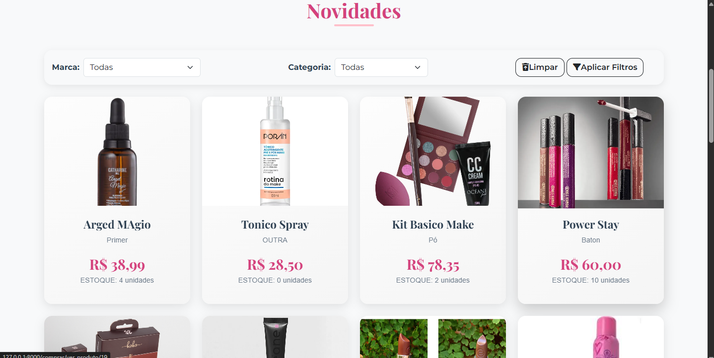
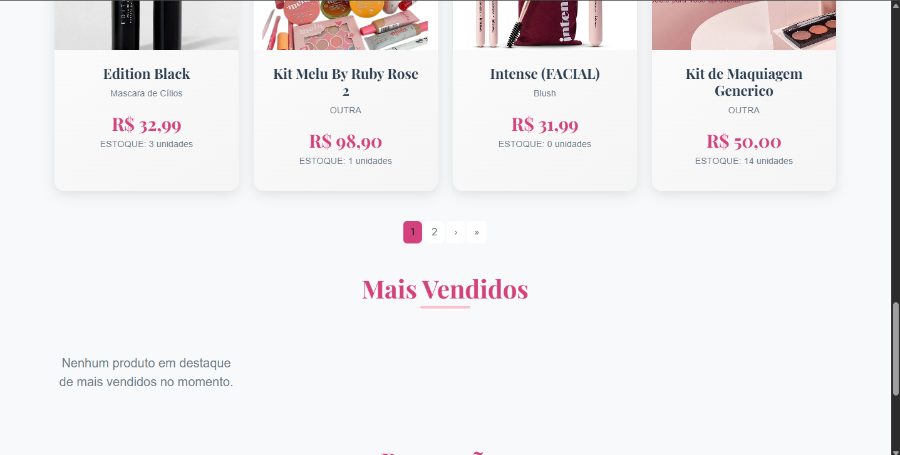
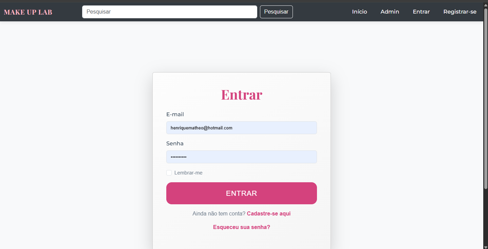
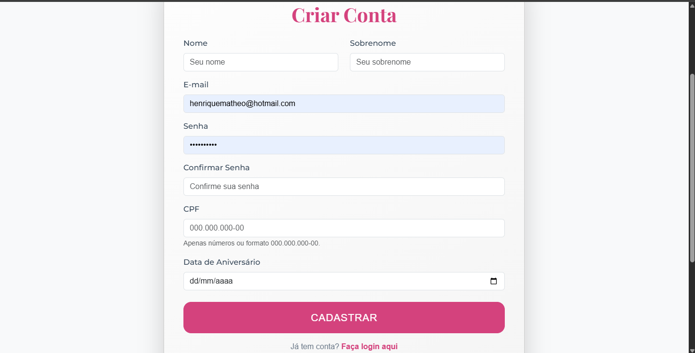
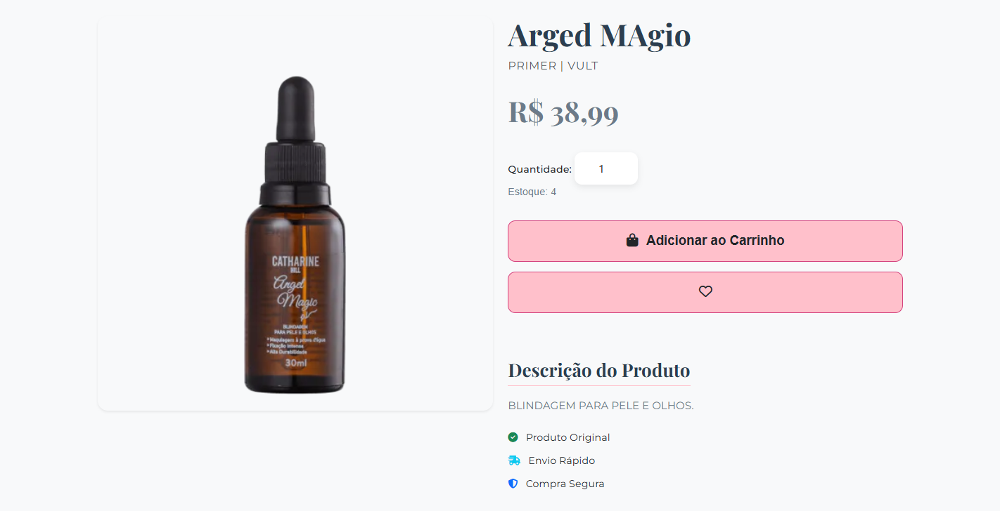
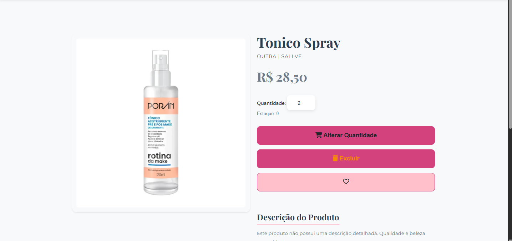
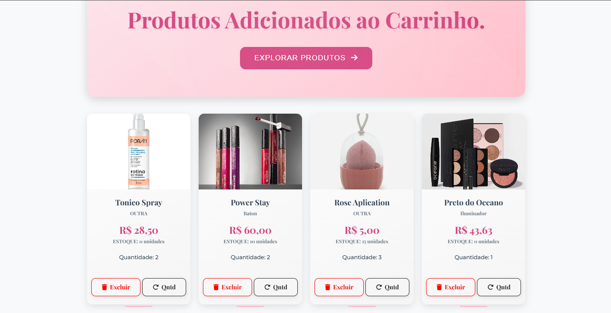
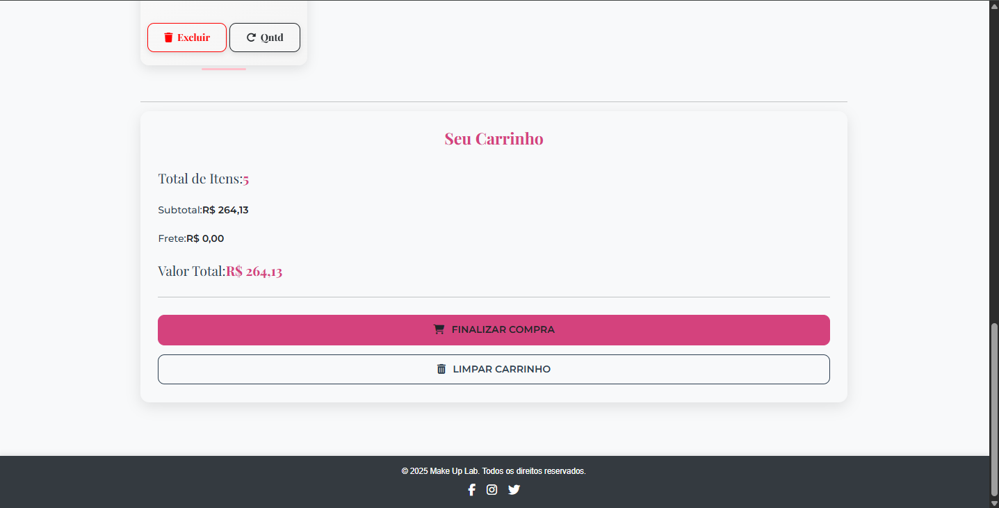
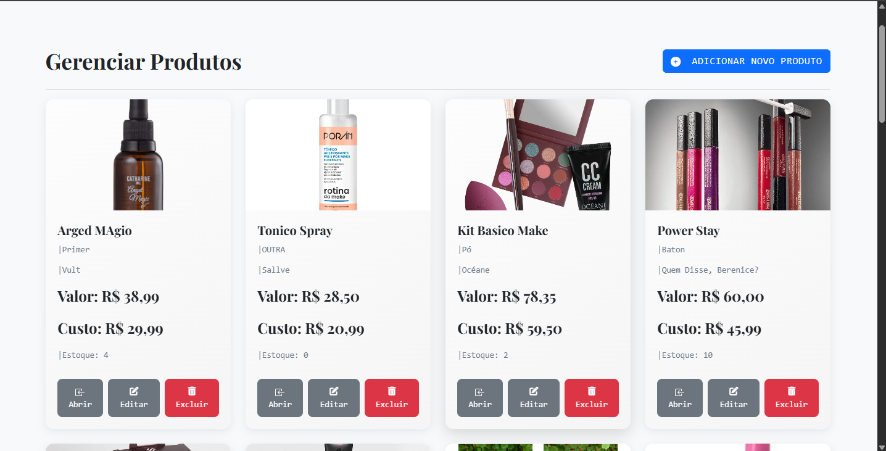
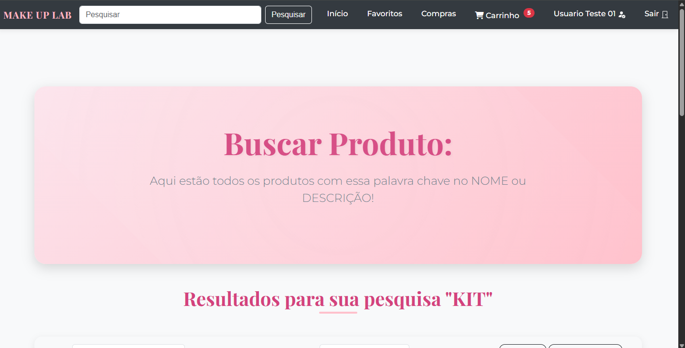

# MAKE UP LAB


-----
## Plataforma de e-commerce completa para o segmento de beleza, desenvolvida em Django. O projeto oferece um painel de administração para gestão total de produtos (cadastro, edição, remoção) e uma experiência de compra rica para o usuário, que pode criar contas, gerenciar favoritos, utilizar o carrinho. A busca por nome e descrição, juntamente com filtros por marca e categoria, garantem uma navegação eficiente e intuitiva.

### As principais funcionalidades incluem:

- Painel Administrativo: O administrador pode adicionar, editar e remover produtos, gerindo o catálogo de forma eficiente e em tempo real.
- Sistema de Usuários: Os clientes podem criar contas, fazer login, e gerenciar seus dados.
- Carrinho de Compras e Pedidos: Usuários podem adicionar produtos ao carrinho, gerenciar a quantidade.
- Favoritos: A funcionalidade de "Favoritar" permite que os usuários salvem produtos de interesse para visualização futura.
- Busca e Filtros: O sistema oferece um motor de busca robusto por nome e descrição do produto, além de filtros avançados por categoria e marca, otimizando a navegação.
-----
### Tecnologias Utilizadas

  * **Linguagem de Programação**: Python
  * **Framework Web**: Django
  * **Banco de Dados**: SQLite3
  * **Templates**: Django Templating Language (HTML, CSS), Bootstrap
  * **Outras Ferramentas**:
      * pip (gerenciador de pacotes)
      * Git (controle de versão)
      * JavaScript

-----

### Como Rodar o Projeto

Siga os passos abaixo para configurar e executar o projeto em sua máquina local.

#### Pré-requisitos

Certifique-se de ter o **Python3** e o **pip** instalados.

#### 1\. Clonar o Repositório

Abra o terminal e clone o projeto usando o Git:

```bash
git clone https://github.com/Matheo-Henrique-Moura-Silva/make-up-lab-ecommerce-django.git
cd make-up-lab-ecommerce-django
```

#### 2\. Criar e Ativar o Ambiente Virtual

```bash
python -m venv venv
```

  * **No Windows**: `venv\Scripts\activate`
  * **No macOS/Linux**: `source venv/bin/activate`

#### 3\. Instalar as Dependências

Com o ambiente virtual ativado, instale as bibliotecas necessárias:

```bash
pip install -r requirements.txt
```

#### 4\. Rodar as Migrações do Banco de Dados

Aplique as migrações para criar o esquema do banco de dados:

```bash
python manage.py makemigrations
python manage.py migrate
```

#### 5\. Criar um Usuário Administrador

Para acessar o painel de administração, crie um superusuário:

```bash
python manage.py createsuperuser
```

Siga as instruções para definir nome de usuário, e-mail e senha.

#### 6\. Iniciar o Servidor de Desenvolvimento

```bash
python manage.py runserver
```

O servidor estará rodando em `http://127.0.0.1:8000/`.

-----

### Telas do Sistema














-----

### Contribuição

Contribuições são bem-vindas\! Se você encontrar um bug ou tiver uma ideia de melhoria, sinta-se à vontade para abrir uma *issue* ou enviar um *pull request*.

-----

### Licença

Este projeto está licenciado sob a Licença MIT.

-----

### Autor

  * **Matheo Henrique Moura Silva**
  * https://github.com/Matheo-Henrique-Moura-Silva?tab=repositories
  * www.linkedin.com/in/matheohenrique
